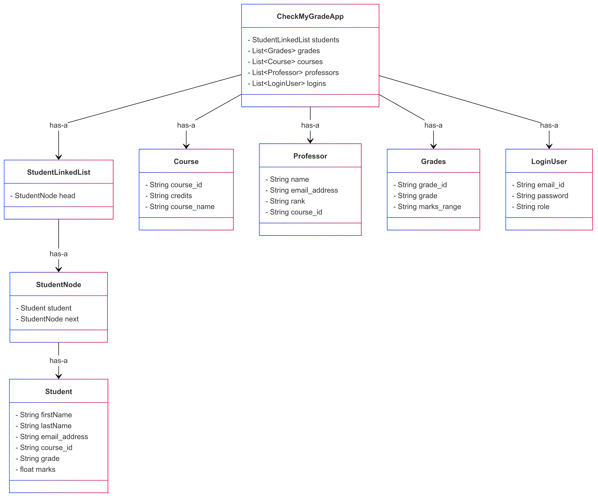

# Final Report for CheckMyGrade Application

## Abstract
This document serves as the final report for the CheckMyGrade Application, a Python-based student grade management system developed for academic course management. The application provides functionalities for managing student records, courses, professors, grades, and user login. Extensive unit tests have been implemented to ensure the robustness of the system.

## Introduction
The CheckMyGrade Application is designed to streamline the management of academic data and enhance the user experience by offering an intuitive command-line interface. Key features include:
- **Student Operations:** Add, update, delete, and search student records using a linked list structure.
- **Course and Professor Management:** Manage courses and professors, and display associated details.
- **Grade and Report Generation:** Process grade information and generate various reports (e.g., course-wise, professor-wise, and student-wise).
- **User Authentication:** Secure login operations with password encryption.
- **Data Persistence:** Store and retrieve data using CSV files.

## Project Architecture and Design
The application employs an object-oriented design with a modular structure. The main components are:

- **Student:** Manages individual student details.
- **StudentLinkedList:** Handles the collection of student records.
- **Grades:** Manages grade details and operations.
- **Course:** Contains course-specific information.
- **Professor:** Maintains professor data and their course associations.
- **LoginUser:** Implements user login, password encryption, and authentication.
- **CheckMyGradeApp:** Acts as the main controller that integrates all modules and presents a menu-driven interface.

### Class Diagram
The class diagram below illustrates the relationships among the various classes in the project.

## Implementation Details
The project is implemented in Python, with file I/O operations performed via CSV files for data storage:
- **Source Code Files:**
  - `checkmygrade_app.py` – Main application code.
  - `test_checkmygrade_app.py` – Unit tests for validating application functionalities.
- **Data Files:**
  - `Student.csv`
  - `Course.csv`
  - `Professor.csv`
  - `Grades.csv`
  - `Login.csv`

The code is structured to ensure ease of maintenance, modularity, and scalability, making it straightforward to add new features or modify existing ones.

## Testing and Terminal Outputs
The functionality of the application has been validated through comprehensive testing. Below are placeholders for the terminal screenshots that demonstrate the working of the application:

### Terminal Screenshot 1: Application Launch and Main Menu
*Paste terminal screenshot showing the application startup and main menu here.*

### Terminal Screenshot 2: Student Operations
*Paste terminal screenshot showing examples of student record addition, deletion, and updates.*

### Terminal Screenshot 3: Report Generation
*Paste terminal screenshot displaying the outputs of report generation (e.g., sorted lists, average/median marks).*

### Terminal Screenshot 4: Unit Tests Execution
*Paste terminal screenshot showing the results of running `test_checkmygrade_app.py`.*

## Conclusion
The CheckMyGrade Application effectively meets the project requirements for managing student grades and related academic data. The modular design and robust implementation ensure that the system is both maintainable and scalable. Unit tests confirm that the major functionalities operate as expected, providing a solid foundation for further enhancements.

## Appendices
- **Source Code:** Refer to `checkmygrade_app.py` and `test_checkmygrade_app.py` for the complete codebase.
- **Data Files:** CSV files (`Student.csv`, `Course.csv`, `Professor.csv`, `Grades.csv`, `Login.csv`) store persistent data.
- **Class Diagram:** See `draw.io_final.png` for the visual representation of the system architecture.
- **Terminal Screenshots:** Attach all relevant terminal working screenshots as shown in the above sections.

---

*End of Report*

